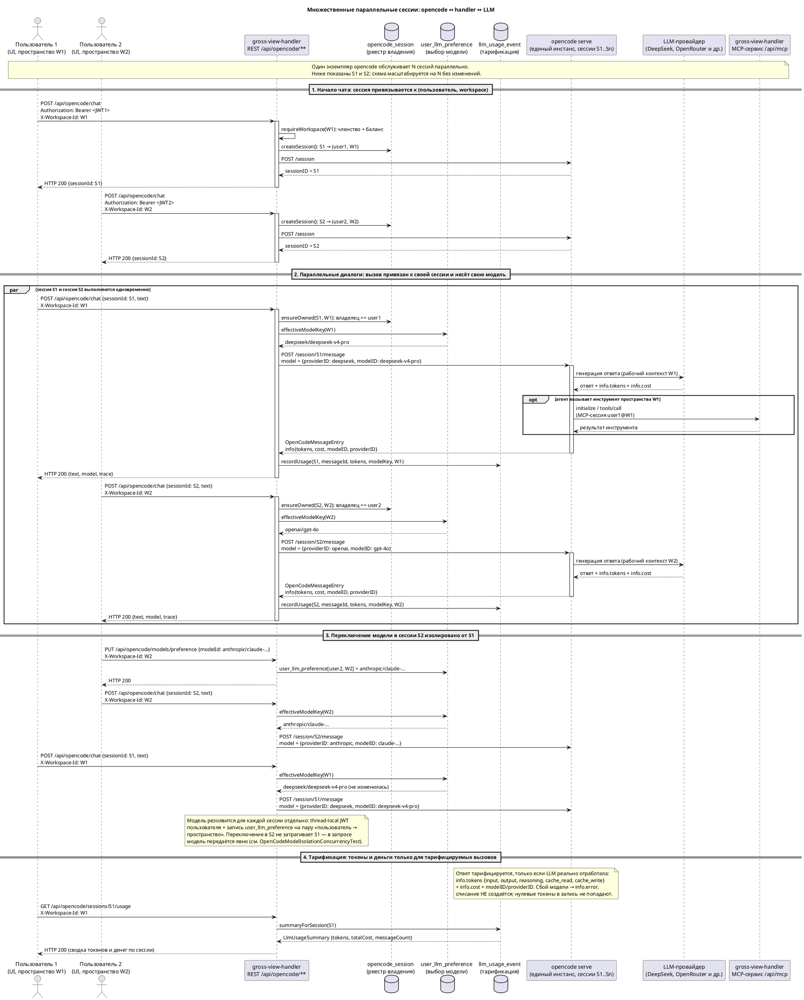
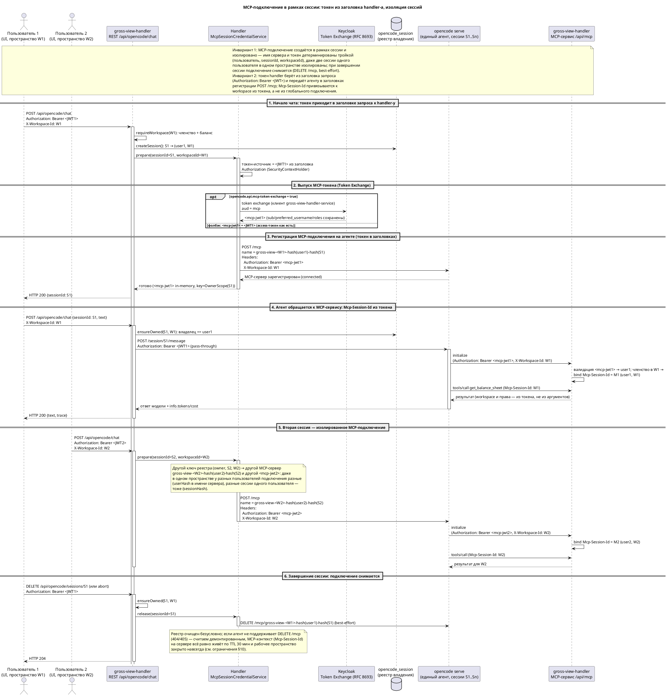

# OpenCode ↔ gross-view MCP: integration plan (docker + k8s)

> Обновлено: 2026-09-24. Описывает, как MCP-сервер gross-view-handler (`/api/mcp`)
> подключается к ИИ-агенту opencode, и все доработки инфраструктуры
> (docker-compose и K8s-манифесты), необходимые для этого.
>
> **Изменение 2026-09-24 (доработка по R1/R2):** §9 переведён из плана в
> реализацию — MCP-подключение теперь **каждой сессии** (не пары «пользователь +
> workspace»): handler регистрирует на агенте изолированный MCP-сервер
> `gross-view-<workspaceId>-<userHash>-<sessionHash>` через `POST /mcp` с
> заголовками `Authorization: Bearer <mcp-jwt>` + `X-Workspace-Id`, токен —
> из inbound-заголовка запроса (Token Exchange RFC 8693, audience `mcp`), при
> завершении сессии подключение снимается (`DELETE /mcp`, best-effort).
> Статичный общий OAuth-сервер (`opencode mcp auth gross-view`) **удалён из
> инфраструктуры** (entrypoint / compose / k8s / .env.example) — см. §10 «Аудит».
> Также добавлен §8 — UML-диаграмма множественных параллельных сессий (изоляция
> модели, тарификация токенов/денег).
>
> **Изменение 2026-09-21:** отменён dedicated сервис-аккаунт и общий токен.
> Оба направления аутентифицируются **реальным пользователем** (JWT):
> - handler → opencode: **сквозной JWT пользователя** (Bearer), HTTP Basic удалён;
> - opencode → handler `/api/mcp`: **OAuth 2.0 (RFC 9728)** — PKCE auth-code
>   реального пользователя через публичный Keycloak-клиент `opencode-mcp`.
> Токены общего сервис-аккаунта (`service-account-opencode-agent` +
> конфиденциальный клиент `opencode-agent`) из инфраструктуры **удалены**.

## 1. Контекст

- **gross-view-handler** — Spring Boot 4.1 (Java 21) backend. Реализует
  **собственный MCP-сервер** (Streamable HTTP, JSON-RPC 2.0) на `POST/GET /api/mcp`
  без стороннего MCP-SDK.
- **opencode** — развёртываемый ИИ-агент (`ghcr.io/anomalyco/opencode`), который
  обязан быть подключён к MCP-сервису handler-а. Пользователь обращается к агенту
  через чат в gross-view UI.
- Ключевое архитектурное решение handler-а — **workspace привязывается к MCP-сессии
  при `initialize` по субъекту JWT**, см. §2. Оно определяет, какие сущности
  (клиент Keycloak, членства, workspace-scoping) обязаны существовать в инфраструктуре.

## 2. Аутентификация и workspace: как это устроено в handler-е

### 2.1 REST-чат (UI → handler → opencode)

1. UI шлёт на `POST /api/opencode/{chat,analyze}` пользовательский **JWT
   (Keycloak)** + заголовок **`X-Workspace-Id`**.
2. Handler проверяет JWT через Spring OAuth2 Resource Server (Nimbus, JWKS
   Keycloak), затем членство/роль через `WorkspaceAccessService`
   (`ensureMember`/`ensureAnyRole(ADMIN, ANALYST)`) — двойная проверка
   (`@PreAuthorize` + сервис).
3. Handler обращается к **серверу opencode по Feign** (`opencode.api.base-url`)
   и **пробрасывает JWT текущего пользователя** в `Authorization: Bearer <jwt>`
   (из `SecurityContextHolder`; при отсутствии JWT-контекста заголовок не
   выставляется). Никаких постоянных учётных данных сервера
   (`OPENCODE_SERVER_USERNAME`/`OPENCODE_SERVER_PASSWORD`) у handler-а больше нет —
   сервер opencode живёт на внутренней сети без собственной аутентификации, JWT
   служит для атрибуции вызовов в логах/сессиях opencode. Handler создаёт сессию,
   фиксируя владельца + workspace в таблице `opencode_session`
   (изоляция чатов между пользователями).

### 2.2 MCP (агент → handler `/api/mcp`)

1. `GET /.well-known/oauth-protected-resource` (RFC 9728) отдаёт метаданные:
   `resource = https://…/api/mcp`, `authorization_servers[0] = <issuer-uri>`
   (ровно `{KEYCLOAK_URL}/realms/gross-view-realm` без trailing slash),
   `scopes = [openid, offline_access]`.
2. `POST /api/mcp` без токена → `401` +
   `WWW-Authenticate: Bearer resource_metadata="..."` — точка входа в OAuth-флоу.
3. Клиент (opencode CLI) делает OIDC discovery → PKCE auth-code → JWT.
4. `initialize {params: {workspace_id}}` → `WorkspaceService.resolveWorkspaceId()`:
   проверка членства по `preferred_username` (основной ключ) / `sub` из JWT →
   `McpSessionStore.bind(sessionId, workspaceId, username)` → `Mcp-Session-Id`.
5. `tools/call` и `resources/read` читают workspace из контекста сессии
   (TTL 30 мин), **не из аргументов** (`workspace_id` из inputSchema удалён).
6. Требуемая роль на `/api/mcp`: `MCP` / `DESIGNER` / `OZON_IMPORT` / `ANALYST` /
   `ADMIN` (`@PreAuthorize("hasAnyRole(...)")`).

**Следствие для инфры:** workspace MCP-сессии определяется **субъектом JWT,
который агент предъявляет на `/api/mcp`**. Для развёрнутого агента этот токен
минтится handler-ом per-session из токена заголовка запроса пользователя и
передаётся агенту при регистрации (см. §9); ОAuth реального пользователя
(§3.1/§3.2) остаётся механизмом только для локального CLI.

## 3. Сценарии подключения агента и выбор токена

### 3.1 Локальный CLI пользователя (работает уже сейчас)

```
opencode.json: { "mcp": { "gross-view": { "type": "remote",
                "url": "https://gross-view.local/api/mcp" } } }
opencode mcp auth gross-view   # браузер -> Keycloak -> callback 127.0.0.1:19876
```
Каждый пользователь получает **свой** JWT → свой workspace. Требования:
публичный `mcp.url`/issuer синхронны, роль `MCP` на пользователе, realm-клиент
`opencode-mcp` (public, callback `http://127.0.0.1:19876/mcp/oauth/callback`) — всё
уже есть в `gross-view-realm.json`.

### 3.2 Развёрнутый агент — per-session MCP (актуальная реализация, 2026-09-24)

Развёрнутый (общий) агент **не регистрирует статичное MCP-подключение**. Для
каждой сессии пользователя handler динамически регистрирует **изолированный**
MCP-сервер (`gross-view-<workspaceId>-<userHash>-<sessionHash>`) через `POST /mcp`
с заголовками `Authorization: Bearer <mcp-jwt>` + `X-Workspace-Id`, где `<mcp-jwt>`
выпущен handler-ом из токена **заголовка запроса** пользователя (Token Exchange
RFC 8693, audience `mcp`; фолбэк — сам access-токен). При завершении сессии
(`deleteSession`/`abortSession`) handler снимает подключение (`DELETE /mcp`,
best-effort, см. §10). Токены хранятся в in-memory реестре `McpSessionCredentialService`
(owner + sessionId + workspaceId), в этом флоу **нет** `mcp-auth.json` на volume.

⚠️ **Канонический адрес MCP.** Handler рекламирует `resource = MCP_URL`
(`https://gross-view.local/api/mcp` docker / `https://mint-box.ru/api/mcp` k8s);
opencode (MCP SDK, RFC 9728) при подключении сверяет его с URL сервера. Внутренние
адреса публиковать нельзя (было диагностировано 2026-09-24 на дефолте
`http://host.docker.internal:8082/api/mcp`: `Protected resource ... does not match
expected ...`). Это ограничение относится к подключению в принципе (включая
локальный CLI); для per-session флоу адрес задаёт handler (`OpenCodeMcpService`).

**Требования к инфраструктуре (выполнено):** Token Exchange включён, клиент
`gross-view-handler-service` (confidential) + клиент-ресурс `mcp` в realm, env
`KEYCLOAK_CLIENT_ID`/`KEYCLOAK_CLIENT_SECRET` — см. §3.3. Статичный OAuth-сервер
из `opencode/entrypoint.sh` **удалён** (2026-09-24); публичный клиент
`opencode-mcp` сохранён — им пользуется только локальный CLI (§3.1).

### 3.3 v3 (реализовано) — per-session MCP-подключение

Реализовано на стороне handler-а (`McpSessionCredentialService`, см.
`sketches/descriptions/opencode_session_mcp_connection.md`): для каждой сессии
динамически регистрируется MCP-сервер на агенте
(`gross-view-<workspaceId>-<userHash>-<sessionHash>`) через `POST /mcp` с
заголовками `Authorization: Bearer <mcp-jwt>` и `X-Workspace-Id`. MCP-токен
выпускается **Keycloak Token Exchange (RFC 8693)** с `audience = mcp` (фолбэк —
access-токен пользователя; управляется env handler-а `OPENCODE_MCP_TOKEN_EXCHANGE`).

**Требования к инфраструктуре (выполнено):**

1. **Keycloak** — включить feature Token Exchange: `--features=token-exchange`
   (`docker-compose.yml` → `command: start --import-realm --features=token-exchange`;
   `k8s/base/keycloak-deployment.yaml` → `args`).
2. **Realm** (`gross-view-realm.json`):
   - конфиденциальный клиент `gross-view-handler-service` (service account,
     `publicClient: false`) — им handler аутентифицируется при exchange;
   - клиент-ресурс `mcp` (`bearerOnly`, `authorizationServicesEnabled`) — audience
     для exchange; на нём выдан scope `token-exchange` клиенту
     `gross-view-handler-service` (client policy).
3. **Handler** — `keycloak.client-id`/`client-secret` указывают на
   `gross-view-handler-service` (env `KEYCLOAK_CLIENT_ID`, `KEYCLOAK_CLIENT_SECRET`).
   В `gross-view-handler` (публичный SPA-клиент) обмен невозможен — Token Exchange
   требует конфиденциальный клиент.

## 4. Доработки Docker (реализовано)

| Файл | Изменение |
|---|---|
| `docker-compose.yml` | opencode env: **статические `OPENCODE_MCP_URL/CLIENT_ID/SCOPE` удалены (2026-09-24)** — MCP-серверы регистрируются handler-ом per-session (§9); остаются `BROWSER=none`, LLM-ключ `DEEPSEEK_API_KEY` (проброс из `.env`, см. §4.4), `NODE_EXTRA_CA_CERTS` (TLS к `/api/mcp`); объём `opencode-data` смонтирован в `/root/.config/opencode` **и** `/root/.local/share/opencode`; порт `127.0.0.1:19876` — только для локального CLI-дебага; `depends_on: keycloak` удалён |
| `nginx/gross-view.local.conf` | upstream `/api/` — `host.docker.internal:8082` (handler на хосте, см. ниже) |
| `handler/entrypoint.sh` | импорт self-signed `certs/gross-view.local.crt` в JVM-cacerts (для Nimbus JWKS по `https://gross-view.local/sso/...`) |
| `opencode/entrypoint.sh` | генерирует `/root/.config/opencode/opencode.json` (только `default_agent: mcp-first`, **без** статичного mcp-блока и OAuth) + агента `mcp-first` и skill-справочник (упоминание per-session префикса `gross-view-<ws>-<userHash>-<sessionHash>_<tool>`) |
| `scripts/get-opencode-mcp-token.ps1` | **удалён** (client_credentials не используется) |
| `.env.example` | **удалены `OPENCODE_MCP_URL`, `OPENCODE_MCP_CLIENT_ID`, `OPENCODE_MCP_SCOPE` (2026-09-24)** — статичный OAuth-флоу упразднён, остаются только локальный-CLI примечания; переменные: `OPENCODE_CATALOG_CREATE_MISSING`, `KEYCLOAK_CLIENT_ID`, `KEYCLOAK_CLIENT_SECRET` (Token Exchange); ранее удалены `OPENCODE_SERVER_USERNAME/PASSWORD`, `OPENCODE_PASSWORD`, `OPENCODE_MCP_TOKEN`, `KEYCLOAK_INTERNAL_URL`, `OPENCODE_AGENT_CLIENT_ID/SECRET`, `OPENCODE_TOKEN_MAX_ATTEMPTS`, `OPENCODE_DEFAULT_MODEL` (мёртвая переменная 2026-09-24 — модель передаётся handler-ом per-message, см. §8) |
| `gross-view-realm.json` | realm-роли `MCP`/`ANALYST`/`ADMIN`; публичный клиент `opencode-mcp` (OAuth для opencode); конфиденциальный клиент `gross-view-handler-service` (Token Exchange) + клиент-ресурс `mcp` (audience, scope `token-exchange`); **клиент `opencode-agent` + сервис-аккаунт удалены** |
| `gross-view-handler` (соседний репозиторий) | Feign-клиент OpenCode: **сквозной JWT пользователя вместо HTTP Basic**; серверного пароля у handler-а нет |

> **handler в docker-compose отсутствует** — backend `gross-view-handler`
> (Spring Boot, порт 8082) запускается локально в режиме отладки на хостовом
> компьютере, а nginx/opencode обращаются к нему через `host.docker.internal:8082`.

### 4.1 Порядок запуска

```bash
cd C:\git\gross-view-infra
cp .env.example .env          # заполнить секреты (не коммитить .env)
docker compose up -d          # поднять всю связку (opencode без depends_on keycloak)
# MCP-подключения — АВТОМАТИЧЕСКИЕ и per-session: entrypoint не настраивает
# статичного сервера, аутентификация/`opencode mcp auth` агента НЕ нужны.
# Проверка: открыть чат в gross-view UI → handler зарегистрирует
# gross-view-<ws>-<userHash>-<sessionHash> на агенте (POST /mcp).
```

### 4.2 Обязательные переменные `.env`

```
CREDENTIAL_ENCRYPTION_KEY=<32-байтовый base64> # handler падает без него (fail-fast)
KEYCLOAK_CLIENT_ID=gross-view-handler-service  # confidential клиент для Token Exchange (RFC 8693)
KEYCLOAK_CLIENT_SECRET=<secret>                # его secret
```

> **Статические MCP-переменные удалены (2026-09-24).** `OPENCODE_MCP_URL`/
> `OPENCODE_MCP_CLIENT_ID`/`OPENCODE_MCP_SCOPE` больше не существуют —
> deployed-агент открывает MCP-подключения только per-session через handler
> (§9). Канонический адрес MCP (`https://gross-view.local/api/mcp`) задаётся
> в handler-е (`MCP_URL`) и важен для локального CLI пользователя (§3.1):
> opencode (MCP SDK, RFC 9728) падает «Protected resource … does not match
> expected … (or origin)», если resource из метаданных не совпадает с URL
> подключения. Внутренние адреса (`host.docker.internal:8082`, кластерный DNS)
> не публиковать.

> **Клиент `opencode-mcp`** в realm сохранён (используется только локальным
> CLI): `publicClient: true`, `standardFlowEnabled: true`, redirectUris
> `["http://127.0.0.1:19876/mcp/oauth/callback"]`, дефолтные scope включают
> `openid`. В deployed-флоу этот клиент и `mcp-auth.json` не участвуют —
> пер-сессионные MCP-токены минтит handler (in-memory реестр).

### 4.3 Первичная настройка при существующей БД Keycloak

Роли и клиент, добавленные в `gross-view-realm.json`, применяются **только при
свежем импорте** (`start --import-realm`). На работающем Keycloak выполнить один раз:

```bash
KC=/opt/keycloak/bin/kcadm.sh   # внутри контейнера keycloak
./kcadm.sh config credentials --server http://localhost:8080 --realm master \
  --user $KEYCLOAK_ADMIN --password $KEYCLOAK_ADMIN_PASSWORD
# роли (существуют с импорта; при ручной настройке):
./kcadm.sh create roles -r gross-view-realm -s name=MCP -s name=ANALYST -s name=ADMIN
# публичный клиент OAuth для opencode (если ещё нет):
./kcadm.sh create clients -r gross-view-realm \
  -s clientId=opencode-mcp -s publicClient=true -s standardFlowEnabled=true \
  -s 'redirectUris=["http://127.0.0.1:19876/mcp/oauth/callback"]' \
  -s 'webOrigins=["http://127.0.0.1:19876"]' -s 'defaultClientScopes=["openid"]'
# убрать легаси клиент opencode-agent + сервис-аккаунт, если остались:
./kcadm.sh delete clients/<id> -r gross-view-realm  # clientId=opencode-agent
./kcadm.sh delete users/<id>   -r gross-view-realm  # username=service-account-opencode-agent
```

## 5. Операционные шаги для docker

1. Проверить, что пользователь, который откроет чат, **является членом рабочего
   пространства** (роль `ANALYST` достаточна для финансовых MCP-инструментов;
   `MCP`/`DESIGNER`/`OZON_IMPORT`/`ADMIN` — для доступа к `/api/mcp`). Членство
   заводится в handler-е через `/api/workspaces/.../invitations` или SQL в
   `workspace_member`.
2. Запустить `./gradlew bootRun` handler-а на хосте (порт 8082) и поднять стек
   (п. 4.1).
3. MCP-подключения устанавливаются автоматически при обращении к сессии —
   вручную регистрировать/аутентифицировать агента **не нужно**. Проверка:
   открыть чат в UI (handler зарегистрирует `gross-view-<ws>-<userHash>-<sessionHash>`
   через `POST /mcp`) и вызвать инструмент (`get_account_plan` и т.п.) — он
   отработает в workspace токена, выпущенного handler-ом. При завершении сессии
   (удаление/abort) подключение снимается (`DELETE /mcp`, best-effort).

> **Срок жизни токена.** Пер-сессионный MCP-токен минтится handler-ом из токена
> заголовка запроса при каждом `prepare` (TTL в in-memory реестре) — отдельных
> действий не требуется. Локальный CLI (§3.1) по-прежнему использует OAuth:
> refresh-токен обновляется opencode автоматически; повторный `opencode mcp auth
> gross-view` нужен лишь при потере `~/.local/share/opencode/mcp-auth.json`.

> **Управление провайдерами моделей** (`POST /api/opencode/providers/{id}/connect`,
> OAuth authorize/callback, `POST /api/opencode/models/sync`) работает через
> тот же throughput (Feign сервера opencode) — минимальных прав не требует; ключи
> провайдеров лежат в persistent volume opencode (см. §4.4).

### 4.4 Управление провайдерами и их ключами

**Основной механизм поступления LLM-ключей — переменные окружения контейнера**
opencode (провайдеры сервера читают их напрямую как учётные данные). Для DeepSeek
`DEEPSEEK_API_KEY` пробрасывается из `.env` инфраструктуры через `docker-compose.yml`
(`environment: DEEPSEEK_API_KEY: ${DEEPSEEK_API_KEY:-}`); `.env.example` содержит
заглушку. После изменения ключа контейнер пересоздаётся:

```bash
docker compose up -d opencode
docker compose exec opencode printenv DEEPSEEK_API_KEY   # контроль
```

Handler дополнительно предоставляет REST-эндпоинты для подключения провайдеров
моделей **в рантайме** (UI/API) — используются как альтернатива env, когда ключ
меняется без пересоздания контейнера или провайдер подключён через OAuth:

- `POST /api/opencode/providers/{id}/connect` — подключение API-ключом
  (`PUT /auth/{id}` на сервере opencode, ключ хранится в конфиг-директории
  сервера `/root/.config/opencode`, не в инфраструктурных Secret);
- `POST /api/opencode/providers/{id}/oauth/authorize|callback` — OAuth-подключение;
- `POST /api/opencode/models/sync` — синхронизация справочника `llm_model`
  от handler-а из каталога сервера (`GET /provider`); флаг `createMissing`
  (по умолчанию — env handler-а `OPENCODE_CATALOG_CREATE_MISSING=false`)
  разрешает создавать неизвестные модели справочника как неактивные;
- `GET /api/opencode/providers|config|providers/auth` — чтение состояния.

Инфраструктурных требований это не добавляет: все вызовы идут через Feign handler-а
(со сквозным JWT пользователя) к внутреннему адресу opencode
(`opencode:4096` / `opencode.gross-view.svc.cluster.local:4096`) и не требуют
новых Secret-ов. Ключи провайдеров, заведённые через runtime-механизм, лежат в
persistent volume (PVC/volume opencode-data) и переживают перезапуск контейнера;
учитывать при бэкапе этого volume. Ключи через env (`DEEPSEEK_API_KEY`)
переживают перезапуски по определению и не попадают в volume — их источник —
`.env`/Secret инфраструктуры.

## 6. План доработок K8s (реализовано, применять при постановке API-деплоя)

1. **Новые манифесты** `k8s/base/gross-view-api-deployment.yaml` +
   `gross-view-api-service.yaml` (Deployment `gross-view-api` + ClusterIP :8082,
   зеркало docker `handler`): image `gross-view.registry.twcstorage.ru/gross-view/gross-view-handler`,
   env: `KEYCLOAK_URL=mint-box.ru`, `POSTGRES_URL=postgres:5432`,
   `DB_USER/DB_PASS` из `gross-view-secrets` (`gv_db_user`/`gv_db_password`),
   `CREDENTIAL_ENCRYPTION_KEY`, `OPENCODE_BASE_URL=http://opencode.gross-view.svc.cluster.local:4096`.
   **Никаких `OPENCODE_SERVER_USERNAME/PASSWORD` у handler-а больше нет** — сервер
   opencode без собственной аутентификации (внутренняя сеть), вызовы идут со
   сквозным JWT. `MCP_URL=https://mint-box.ru/api/mcp`.
   (nginx в K8s **уже** резолвит `gross-view-api.gross-view.svc.cluster.local:8082`)
2. **`kustomization.yaml`**: включить `gross-view-api-*.yaml`;
   раскомментировать `opencode-deployment/service/pvc.yaml` и
   `opencode-entrypoint-configmap.yaml`.
3. **`secret.yaml`**: ✅ сделано — удалены `opencode_server_username`,
   `opencode_server_password`, `keycloak_internal_url`, `opencode_agent_client_id`,
   `opencode_agent_client_secret`. Остаются секреты БД, Keycloak, registry и прочие +
   строки для `credential_encryption_key` и `keycloak_client_secret` (добавятся с
   манифестами API).
4. **`opencode-deployment.yaml`**: ✅ сделано — `initContainer wait-for-keycloak`
   **удалён** (entrypoint Keycloak не вызывает); env без OAuth-credentials и без
   статичного MCP-конфига (2026-09-24): только `BROWSER=none` + LLM-ключ
   `DEEPSEEK_API_KEY` (secretKeyRef `gross-view-secrets/deepseek_api_key`) —
   `OPENCODE_MCP_URL`/`OPENCODE_MCP_CLIENT_ID`/`OPENCODE_MCP_SCOPE` **удалены**,
   MCP-серверы регистрирует handler per-session (§9); entrypoint монтируется из
   ConfigMap `opencode-entrypoint` (`opencode-entrypoint-configmap.yaml`,
   `defaultMode: 0555`, скрипт синхронизирован с docker-версией
   `opencode/entrypoint.sh`); **второй volumeMount**
   `opencode-data → /root/.local/share/opencode` оставлен (runtime-данные/модели;
   OAuth-токенам больше не нужен).
5. **Токен**: пер-сессионные MCP-токены минтит handler (in-memory реестр,
   Token Exchange); `mcp-auth.json` на PVC **не используется** deployed-агентом.
   При логине другого пользователя — ничего перерегистрировать не нужно.
6. **Realm** (общий с docker): роли `MCP`/`ANALYST`/`ADMIN`, публичный клиент
   `opencode-mcp`, конфиденциальный `gross-view-handler-service` + клиент-ресурс
   `mcp` (audience Token Exchange) — импортируются свежим `mint-box.ru`
   realm-импортом; на работающих кластерах — kcadm (см. §4.3). Легаси
   `opencode-agent`/сервис-аккаунт удалены из импорта. Keycloak запускается с
   `--features=token-exchange` (`keycloak-deployment.yaml` → `args`).
7. **Бюджет ресурсов**: handler ≈ 200m CPU / 300–400Mi RAM requests. Ориентир узла
   `~800m / ~1500Mi` будет превышен — поднять узел до 2 CPU или пересмотреть limits.
8. Обновить AGENTS.md (расписание сервисов, таблица ресурсов).

## 7. Связанные файлы handler-а (для справки)

- `controller/McpController.java` — `initialize`/session binding, 401 + `resource_metadata`.
- `config/SecurityConfig.java` — OAuth2 Resource Server, `@PreAuthorize` роли.
- `service/workspace/WorkspaceService.java#resolveWorkspaceId` — членство по JWT.
- `service/integro/opencode/OpenCodeClient.java` — Feign-клиент сервера opencode.
- `config/OpenCodeFeignConfig.java` — RequestInterceptor: **сквозной JWT пользователя**
  (из `SecurityContextHolder`) в `Authorization: Bearer`.
- `service/mcp/OAuthMetadataService.java` — `mcp.url`/issuer-uri (`MCP_URL`, `KEYCLOAK_URL`).

## 8. Параллельные сессии: диаграмма взаимодействия opencode с окружением

Единый инстанс `opencode serve` обслуживает **много одновременно запущенных
сессий** (чаты разных пользователей/пространств). Ниже — UML-диаграмма
(sequence) этого режима; она фиксирует три инварианта:

1. **Привязка вызовов к сессии.** Все обращения handler-а к агенту адресуют
   конкретную сессию (`POST /session/{id}/message`, изредка `POST /session` при
   создании) и проходят `ensureOwned()` по реестру `opencode_session`
   (владелец + workspace). Чужой/несуществующей сессии не существует для
   пользователя.
2. **Изоляция выбора LLM по сессии.** В каждом запросе модель передаётся явно
   объектом `{providerID, modelID}`; выбор резолвится в handler-е отдельно для
   каждой сессии (thread-local JWT пользователя + запись `user_llm_preference`
   на пару «пользователь → пространство»). Переключение модели в одной сессии
   **не влияет** на остальные (доказано `OpenCodeModelIsolationConcurrencyTest`:
   100 параллельных раундов двух пользователей без «протечки» модели).
3. **Тарификация в токенах и деньгах.** Ответ агента несёт `info.tokens`
   (`input`/`output`/`reasoning`/`cache_read`/`cache_write`) и `info.cost` +
   фактические `modelID`/`providerID`. Поле присутствует в тех запросах, где
   LLM реально отработала (тарифицируемый вызов); сбой модели (в т.ч. `402
   Insufficient Balance`) → `info.error` и **списания нет**.



Соответствие диаграммы требованиям (по коду handler-а):

| Инвариант | Элементы диаграммы | Код |
|---|---|---|
| Привязка вызовов к сессии | `ensureOwned` (владелец + workspace) в каждом вызове; путь `/session/{id}/message` | `OpenCodeSessionService#ensureOwned` / `#resolveSessionId`, реестр `opencode_session` |
| Изоляция LLM по сессии | `effectiveModelKey(W)` → `model = {providerID, modelID}` в каждом запросе; переключение в S2 не трогает S1 | `LlmPreferenceService#effectiveModelKey`, `user_llm_preference`, `OpenCodeModelIsolationConcurrencyTest` |
| Тарификация токенами и деньгами | `info.tokens` + `info.cost` в ответе агента (тарифицируемые запросы); `recordUsage` → `llm_usage_event`; `summaryForSession` | `OpenCodeMessageInfo`/`OpenCodeTokenUsage`, `LlmUsageService#recordUsage` (идемпотентно по `(sessionId, messageId)`) |

## 9. MCP-подключение в рамках сессии: поток аутентификации и изоляции

Два инварианта работы агента с MCP-сервисом handler-а (`/api/mcp`):

1. **Подключение происходит в рамках сессии и изолировано от других сессий.**
   MCP-сервер на агенте регистрируется динамически **перед отправкой сообщения
   сессии**. Имя сервера и MCP-токен детерминированы **тройкой «пользователь +
   sessionId + workspaceId»**: каждая сессия (в т.ч. две сессии одного
   пользователя в одном пространстве) получает **свой** MCP-сервер
   (`gross-view-<workspaceId>-<userHash>-<sessionHash>`) и свой `Mcp-Session-Id`.
   При завершении сессии (`deleteSession`/`abortSession`) handler **снимает**
   подключение с реестра и делает `DELETE /mcp` на агенте (best-effort); при
   пересоздании сессии сервер регистрируется заново.
2. **Токен для подключения — из заголовка запроса от gross-view-handler.**
   Handler берёт исходный токен из **inbound-заголовка** `Authorization: Bearer
   <JWT>` (пользовательский access-токен, пришедший в `POST /api/opencode/chat`),
   при включённом Token Exchange (env `OPENCODE_MCP_TOKEN_EXCHANGE`) обменивает его
   на короткоживущий `aud=mcp` JWT, после чего передаёт токен + workspace агенту
   **в заголовках динамической регистрации** (`POST /mcp`:
   `Authorization: Bearer <mcp-jwt>`, `X-Workspace-Id: <W>`). Агент подставляет
   эти заголовки в каждый вызов `/api/mcp`, и `Mcp-Session-Id` привязывается
   к workspace **из JWT**.



Соответствие инвариантов коду handler-а и инфраструктуре:

| Инвариант | Элементы диаграммы | Код handler-а | Инфраструктура |
|---|---|---|---|
| Токен для подключения — из заголовка запроса handler-а | §1 `Authorization: Bearer <JWT>`; §2 exchange/fолбэк; §3 токен в заголовках `POST /mcp`; §4 агент предъявляет его на `/api/mcp` | `McpSessionCredentialService#issueCredential` (`currentUserService.getAccessToken()` — JWT из `SecurityContextHolder`), `#headers()` (`Authorization` + `X-Workspace-Id`); `KeycloakAuthService#exchangeUserToken`; `OpenCodeClient#addMcpServer` (`POST /mcp`) | realm: `gross-view-handler-service` (confidential) + клиент-ресурс `mcp` (audience, scope `token-exchange`); `--features=token-exchange`; env `OPENCODE_MCP_TOKEN_EXCHANGE`; `.env.example`: `KEYCLOAK_CLIENT_ID/SECRET` |
| Подключение в рамках сессии, изоляция от других сессий | §1/§3 `prepare(sessionId, workspaceId)`; §5 второй пользователь/сессия — отдельное подключение; §4 `Mcp-Session-Id` из токена; §6 `release` — демонтаж | `OpenCodeSessionService#prepareMcpConnection(sessionId, workspaceId)` перед каждым `sendMessage`; `McpSessionCredentialService#prepare(sessionId, workspaceId)` (ключ `OwnerScope(owner, sessionId, workspaceId)`), `#release(sessionId)` (registry clean + `removeAgentServer` в `deleteSession`/`abortSession`), `#serverName` (`gross-view-<workspaceId>-<userHash>-<sessionHash>`); демонтаж — `OpenCodeMcpService#removeRemoteServer` + `OpenCodeClient#deleteMcpServer` (`DELETE /mcp/{id}`); `McpSessionStore.bind` → `Mcp-Session-Id` | динамическая регистрация через `POST /mcp` (идемпотентна per-сессии); **статичный OAuth-сервер `gross-view` удалён из `opencode/entrypoint.sh`/compose/k8s (2026-09-24)** — в сессионном флоу участвует только локальный CLI (§3.1/§3.2) |

## 10. Аудит соответствия требованиям (2026-09-24)

Фиксация результатов аудита проекта (инфраструктура + gross-view-handler) по
двум требованиям к MCP и список выполненных доработок.

| Требование | Статус до доработки | Доработка (2026-09-24) | Статус после |
|---|---|---|---|
| **R1. MCP-подключение в рамках сессии, изоляция от других сессий** | Частично: подключение изолировано по паре «пользователь + workspace», но **не по чат-сессии** (две сессии одного пользователя в одном пространстве делили одно подключение); демонтаж на агенте при завершении сессии не выполнялся | `McpSessionCredentialService`: ключ `OwnerScope(owner, sessionId, workspaceId)`, `prepare(sessionId, workspaceId)`, `release(sessionId)`; имя сервера включает `sessionHash` (`gross-view-<ws>-<userHash>-<sessionHash>`); `deleteSession`/`abortSession` → `release` (best-effort `DELETE /mcp/{id}` через `OpenCodeMcpService#removeRemoteServer`); порядок в `OpenCodeSessionService`: `resolveSessionId` → `prepareMcpConnection` | Выполнено (изоляция теперь пер-сессионная) |
| **R2. Токен для подключения — из заголовка запроса от gross-view-handler** | Выполнено: handler берёт JWT из заголовка запроса и передаёт агенту в заголовках `POST /mcp` (`Authorization` + `X-Workspace-Id`); пер-сессионный exchange (RFC 8693, audience `mcp`) | Без изменений (подтверждено аудитом); дополнительно: убрана статичная OAuth-тропинка («свой токен у агента») — она противоречила требованию | Выполнено |

Выполненные работы (детали — §3.2/§3.3/§4/§6/§9):

- **handler** (`gross-view-handler`): во всех send-путях (`sendMessage`,
  `sendMessage(request)`, `sendPromptAsync`) подготовка MCP-подключения выполняется
  **после** `resolveSessionId` — сессия обязательна и принадлежит владельцу до
  регистрации MCP; `deleteSession`/`abortSession` снимают подключение
  (`release(sessionId)`). Ключевые классы: `McpSessionCredentialService`,
  `OpenCodeSessionService`, `OpenCodeMcpService` (`removeRemoteServer`),
  `OpenCodeClient#deleteMcpServer`. Тесты: переписан `McpSessionCredentialServiceTest`
  (изоляция сессий, демонтаж, нулевые аргументы), дополнен
  `OpenCodeSessionServiceTest` (release при delete/abort) — все целевые тесты зелёные.
- **инфраструктура** (`gross-view-infra`): статичный общий OAuth-сервер `gross-view`
  удалён из `opencode/entrypoint.sh` (+ k8s ConfigMap, byte-identical), из
  `docker-compose.yml` (env `OPENCODE_MCP_URL/CLIENT_ID/SCOPE`), из
  `k8s/base/opencode-deployment.yaml`, из `.env.example`. `opencode.json`
  развёрнутого агента больше не содержит `mcp`-блока — все MCP-подключения
  создаёт handler per-session. Агент `mcp-first` и skill-справочник обновлены
  (упоминание пер-сессионного префикса `gross-view-<ws>-<userHash>-<sessionHash>_<tool>`).

**Сознательные ограничения / TODO после доработки:**

- **Демонтаж на агенте — best-effort.** Если установленный opencode не
  поддерживает `DELETE /mcp/{id}` (404/405 — запрос проглатывается), реестр
  handler-а очищается, но сервер остаётся зарегистрированным у агента до его
  перезапуска. При консервативном TTL-анализе: имя сервера детерминировано
  sessionId, коллизий между живыми сессиями нет; вклад в лимит серверов агента —
  только от завершённых сессий. TODO: подтвердить поддержку `DELETE /mcp` в
  целевой версии opencode; при отсутствии — пороговая перерегистрация/cleanup.
- **Порог числа подключений.** Per-сессионные серверы масштабируются линейно с
  числом параллельных сессий на одном агенте; при большом N проверить лимиты
  opencode на количество MCP-серверов.
- **Локальный CLI** по-прежнему регистрирует gross-view через OAuth в своём
  `opencode.json` — это осознанно: CLI вне сессионного флоу handler-а.
- **Realm**: токен `mcp` (audience) и confidential-клиент `gross-view-handler-service`
  остаются обязательными; `opencode-mcp` (public) нужен только CLI.
- **k8s**: opencode-манифесты по-прежнему закомментированы (phase 2); после
  включения — новый entrypoint-ConfigMap и deployment env из §6 применяются
  без дополнительных шагов.